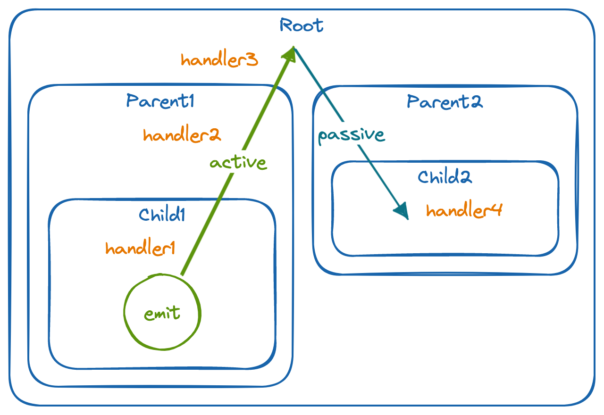

# Tuff Messages

Instead of traditional DOM event handlers, events in Tuff are handled through a custom _messages_ system. It is necessary due to the detached nature of the declarative UI and the actual DOM manipulation, but also offers some advantages over traditional event handlers:

1. The ability to passively handle messages that happen outside of a part's particular branch of the DOM tree
2. Easily attach multiple message keys to the same element and multiple handlers for the same message key
3. Use a single handler for messages emitted from many different elements down the DOM tree (similar to jQuery's `.on()`)
4. Decouple the emitting and handling of messages while leveraging the type system for correctness (message keys are statically typed and don't rely on strings)
5. Force message emitters to pass strongly-typed data, which handlers can then receive

## Message Keys

Messages are identified by *keys* (instead of e.g. strings) to allow the type system to force correctness and avoid typos.
New message keys are created with the `Messages.untypedKey()` and `Messages.typedKey<T>()` functions and are used to declare which messages are emitted from a particular element:

```typescript
const FooKey = Messages.untypedKey()

const type BarData = {
    value: number
}
const BarKey = Messages.typedKey<BarData>()
```


## Emitting and Handling Messages

Once a key is defined, it can be emitted in response to an event with one of the many `emit*()` methods on elements:

```typescript
class Button extends Part<ButtonState> {
    render(parent: PartTag) {
        // .emitClick(key) is a shortcut for .emit("click", key)
        // passing a typed key forces you to also pass that type
        parent.a(".button", {text: this.state.text})
            .emitClick(FooKey)
            .emitClick(BarKey, {value: 42})
    }
}
```

Then, either the same part or another part in the tree can declare that it will handle the message:

```typescript
class Toolbar extends Part<ToolbarState> {
    async init() {
        // .onClick(key, ...) is a shortcut for .handle("click", key, ...)
        // the message argument contains:
        //  type: the string event type ("click")
        //  event: the raw Event
        //  data: the data passed if the key is typed
        this.onClick(FooKey, message => {
            this.state.foo = 'bar'
            this.dirty()
        })
        this.onClick(BarKey, message => {
            console.log(`Bar clicked with value ${message.data.value}`)
        })
    }
}
```

## Listener Attachment

The `attach` option for listeners specifies whether to listen only for messages from itself or child parts (`'active'`) or from parts anywhere else in the tree (`'passive'`).

Listeners are **active by default** but can be made passive with the `attach: "passive"` option:

```typescript
class OtherPart extends Part<OtherState> {
    async init() {
        // this part will handle the FooKey message even though
        // it's not a parent of the emitting Button parts
        this.onClick(FooKey, m => {
            this.state.numClicked += 1
            this.dirty()
        }, {attach: "passive"})
    }
}
```




## Arbitrary Messages

While the Tuff messaging system is used to handle UI events emitted by the DOM, it can also be used to pass arbitrary messages throughout an application. 

Instead of calling one of the `emit*` methods on a tag while rendering, you can use the `emitMessage()` method on parts to directly emit an arbitrary message and the `listenMessage()` method to handle them:

```typescript
const arbitraryKey = Messages.typedKey<{id: string}>()

async init() {
    this.listenMessage(arbitraryKey, m => {
        console.log(`id: ${m.data.id}`)
    })
}

anotherMethod() {
    this.emitMessage(arbitraryKey, {id: 'foo'})
}
```

By default, messages sent with `emitMessage()` will bubble to the top of the part hierarchy like messages emitted by DOM events. 
To keep the message local to the part, pass `{scope: 'single'}` as the third argument to `emitMessage()`.


## Global Keyboard Events

Unlike mouse and focus events, general keyboard presses bubble directly to the document (unless they're handled by a form input or contenteditable element).
Additionally, the "keypress" event is deprecated in modern Javascript. 

Therefore, Tuff overrides the "keypress" event to to actually handle global keydown events. 
This provides a mechanism for any *Part* to handle global key press events in the same way that other, local events are handled.

In order to ease cross-platform development, special message keys (*KeyPress* objects) are constructed for the global key press events.
Each *KeyPress* takes the key being pressed as well as zero or more *KeyModifiers* that specify the modifier keys in a platform-indepependent manner.

For example, the "control/command" modifier maps to the Command key on macOS and the Control key on other platforms:

```typescript
async init() {
    this.onKeyPress(Messages.keyPress("z", "control/command"), m => {
        // this gets called when command+z is pressed on macOS 
        // and control+z if called on Windows and Linux
    })
}
```

Alternatively, you can register a listener for _any_ global keyboard event using `onAnyKeyPress`:

```typescript
async init() {
    this.onAnyKeyPress(m => {
        // this gets called when any key is pressed
        // m.data will contain the key and modifier
    })
}
```